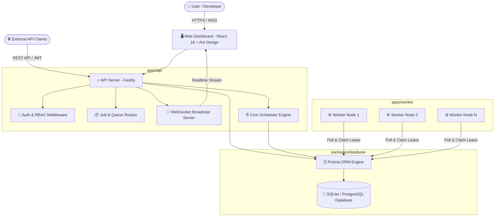
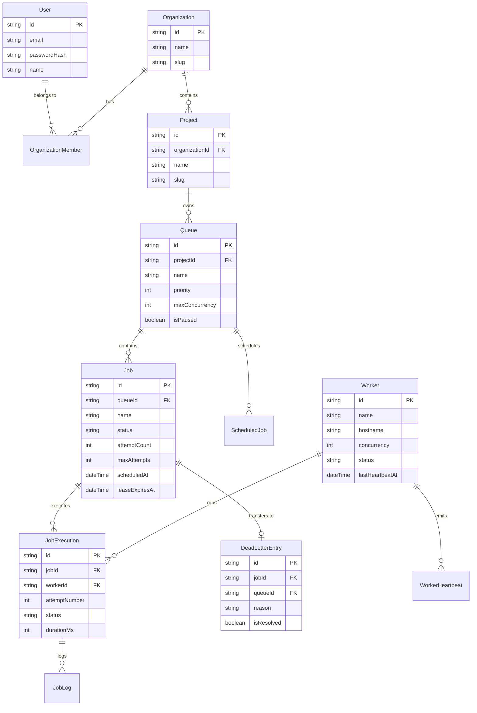
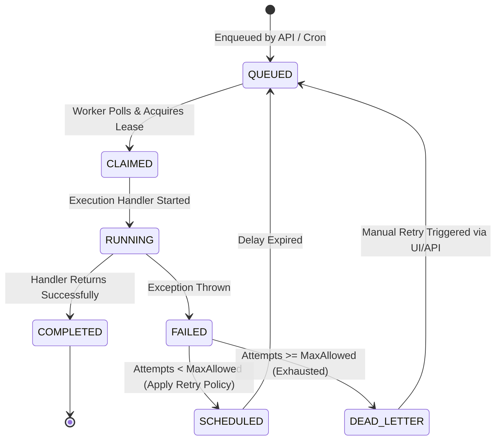

# 🏗️ SchedX - Distributed Job Scheduler System Architecture

## 1. Overview & Core Philosophy

**SchedX** is a high-throughput, fault-tolerant distributed job scheduling platform designed for enqueuing, polling, executing, retrying, and monitoring background workloads at scale. Built as a TypeScript monorepo, SchedX provides atomicity, at-least-once execution guarantees, dynamic queue concurrency controls, real-time execution streams, and an interactive **Ant Design** web dashboard.

---

## 2. High-Level Architecture Diagram



---

## 3. Monorepo Workspaces & Directory Structure

```
job_scheduler/
├── apps/
│   ├── api/                 # Fastify REST API, WebSocket server, OpenAPI docs & Cron Service
│   │   ├── src/
│   │   │   ├── middleware/  # Auth (JWT) & RBAC authorization
│   │   │   ├── routes/      # Jobs, Queues, Workers, DLQ, Cron Schedules, Auth
│   │   │   ├── services/    # WebSocket broadcasting, Cron scheduler, AI summary
│   │   │   └── server.ts    # Fastify server bootstrap & OpenAPI setup
│   ├── worker/              # Autonomous background polling worker engine
│   │   ├── src/
│   │   │   ├── handlers/    # Job handler implementations (email, report, webhook, custom)
│   │   │   ├── runner.ts    # Job lease acquisition, retry backoff & DLQ handler
│   │   │   └── index.ts     # Worker process entrypoint & heartbeat emitter
│   └── web/                 # React 18 Single Page App with Ant Design UI
│       ├── src/
│       │   ├── components/  # JobDispatcher, ExecutionStream, Navbar, StatusBadge
│       │   ├── pages/       # Overview, Queues, Jobs, Workers, ScheduledJobs, DLQ
│       │   └── context/     # Auth, Organization, WebSocket state providers
├── packages/
│   ├── database/            # Prisma Schema, Database Client & Migrations
│   │   └── prisma/
│   │       └── schema.prisma# DB Schema (User, Org, Project, Queue, Job, DLQ, Worker)
│   └── shared/              # Shared TypeScript types, constants & Zod validation schemas
├── ARCHITECTURE.md          # System Architecture & Technical Specifications
└── package.json             # Root monorepo scripts & workspace configuration
```

---

## 4. Subsystems Description

### 4.1 Control Plane (`apps/api`)
- **Fastify Web Framework**: High-performance HTTP server with JSON validation via Zod & OpenAPI schema generation.
- **JWT & RBAC Middleware**: Verifies bearer tokens and validates user permissions (`OWNER`, `ADMIN`, `MEMBER`) across Organization and Project resources.
- **WebSocket Broadcast Engine**: Subscribes to database mutations and broadcasts real-time job execution events (`JOB_DISPATCHED`, `JOB_COMPLETED`, `JOB_FAILED`) to connected browser clients.
- **Cron Scheduler Engine**: Runs an in-memory tick evaluator (every 5000ms) that enqueues scheduled cron jobs when their `cronExpression` matches the current timestamp.

### 4.2 Distributed Execution Engine (`apps/worker`)
- **Polling & Optimistic Locking**: Workers continuously poll active queues for candidate jobs where `status = QUEUED` or `status = SCHEDULED` and `scheduledAt <= NOW()`.
- **Atomic Lease Acquisition**: Claims jobs by updating status to `RUNNING`, assigning `workerId`, and setting `leaseExpiresAt = NOW() + 30s` within an isolated database transaction to prevent double execution.
- **Heartbeat & Self-Healing**: Workers emit heartbeats every 10 seconds. Stale workers (`lastHeartbeatAt > 60s`) have their status auto-updated to `STALE`, and their held leases are released back to `QUEUED`.

### 4.3 Frontend Web Application (`apps/web`)
- **Ant Design UI Framework**: Responsive Light Theme layout with `ConfigProvider` global token configuration.
- **TanStack React Query**: Manages client-side caching, background polling, and optimistic UI mutations for jobs, queues, and worker nodes.
- **Job Dispatcher Component**: Supports single and batch job creation (1 to 50 jobs) with custom payload runtimes (`1s`, `3s`, `5s`) and execution modes (`Standard Success`, `Simulate Failure`, `Scheduled Delay`).
- **Execution Stream Component**: Real-time Event Stream and Execution History table with duration and error traces.

---

## 5. Database Entity Relationship Diagram (ERD)



---

## 6. Execution Lifecycle & Retry Policy



### Retry Policies Supported:
1. **Exponential Backoff**: `delay = baseDelaySeconds * (2 ^ (attempt - 1))`
2. **Linear Backoff**: `delay = baseDelaySeconds * attempt`
3. **Fixed Delay**: `delay = baseDelaySeconds`

---

## 7. Deployment & Port Mapping

| Service / App | Host Interface | Default Port | Description |
| :--- | :--- | :--- | :--- |
| **Web Dashboard** | `0.0.0.0` | `3000` | Ant Design Frontend Application |
| **REST API Server** | `0.0.0.0` | `4000` | Fastify Control Plane API |
| **WebSocket Stream** | `0.0.0.0` | `4000` | WSS Endpoint (`/ws`) |
| **Swagger Docs** | `0.0.0.0` | `4000` | Interactive OpenAPI (`/documentation`) |
| **Worker Node(s)** | Background Daemon | N/A | Autonomous Polling & Job Execution |

---

## 8. Verification & Test Commands

```bash
# Run unit & integration test suite across all monorepo packages
npm run test

# Validate TypeScript type check and build production bundles
npm run build

# Start API, Worker, and Web development servers
npm run dev:api
npm run dev:worker
npm run dev:web
```
