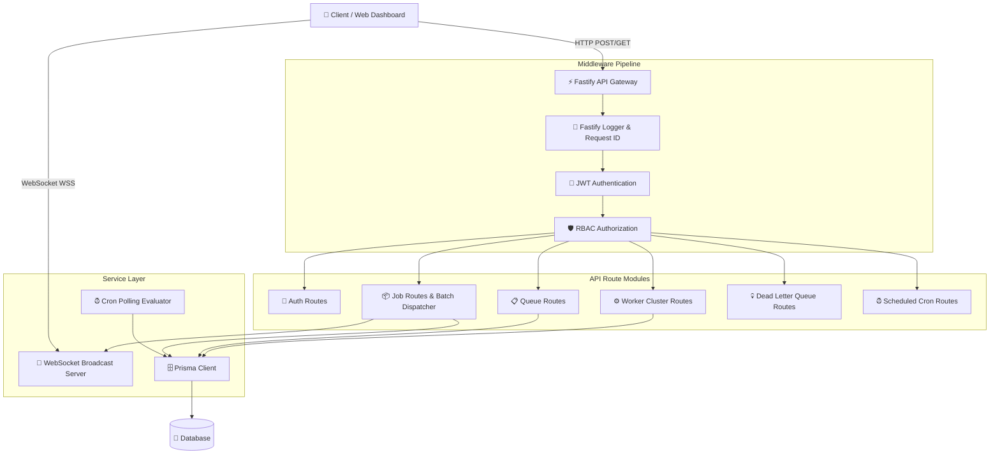
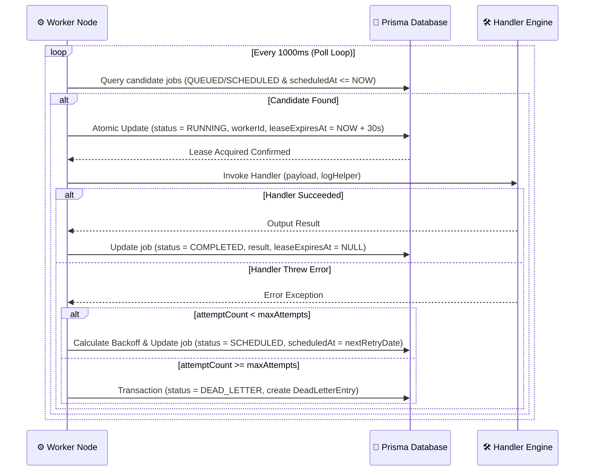

# ⚡ SchedX - Backend Engineering Architecture

## 1. Overview & Technology Stack

The backend of **SchedX** provides the control plane, REST API, realtime event stream, and background execution engine for the job scheduling platform. Built with **TypeScript** and **Node.js**, the backend relies on high-performance frameworks and ORM patterns designed for low-latency job dispatching and fault-tolerant background polling.

### Backend Tech Stack:
- **Web Framework**: Fastify v4 (chosen for low overhead & fast schema serialization)
- **Database Access**: Prisma ORM (Type-safe queries over SQLite / PostgreSQL)
- **Authentication & Security**: `@fastify/jwt` (JWT bearer tokens) & Argon2/Bcrypt password hashing
- **Realtime Streaming**: `ws` (native WebSockets for live execution event feeds)
- **Validation**: Zod (Runtime payload and query parameter validation)
- **API Documentation**: `@fastify/swagger` & `@fastify/swagger-ui` (OpenAPI 3.0 specs)

---

## 2. API & Control Plane Architecture (`apps/api`)



---

## 3. REST API Specification

### 3.1 Authentication & Profile (`/api/v1/auth`)
- `POST /api/v1/auth/register`: Creates new user profile & default Organization/Project.
- `POST /api/v1/auth/login`: Validates credentials and returns JWT bearer token.
- `GET /api/v1/auth/me`: Retrieves authenticated user profile & organization memberships.

### 3.2 Queue Management (`/api/v1/queues`)
- `GET /api/v1/queues?projectId={id}`: Lists queues for a project with priority & concurrency stats.
- `POST /api/v1/queues`: Configures a new queue (`name`, `priority`, `maxConcurrency`).
- `POST /api/v1/queues/:id/pause`: Pauses queue execution.
- `POST /api/v1/queues/:id/resume`: Resumes queue execution.
- `DELETE /api/v1/queues/:id`: Soft/hard deletes a queue.

### 3.3 Job Dispatching & Explorer (`/api/v1/jobs`)
- `GET /api/v1/jobs?projectId={id}&page=1&status=QUEUED&search=email`: Returns paginated job logs.
- `POST /api/v1/jobs`: Enqueues single job with payload, scheduled time, and idempotency key.
- `POST /api/v1/jobs/batch`: Bulk dispatches up to 50 jobs in a single atomic transaction.
- `GET /api/v1/jobs/:id`: Fetches detailed job metadata, execution attempts, and logs.
- `POST /api/v1/jobs/:id/retry`: Manually re-enqueues a failed or dead-letter job.
- `POST /api/v1/jobs/:id/ai-summary`: Triggers Gemini AI diagnosis for execution failure traces.

### 3.4 Worker Cluster Management (`/api/v1/workers`)
- `GET /api/v1/workers`: Lists active, idle, and stale worker nodes with last executed job info.
- `POST /api/v1/workers`: Manually registers a new worker node in the cluster.
- `POST /api/v1/workers/:id/stop`: Stops a worker node (`status = STOPPED`).
- `DELETE /api/v1/workers/:id`: Deregisters and removes a worker node.

### 3.5 Dead Letter Queue (`/api/v1/dlq`)
- `GET /api/v1/dlq`: Lists all permanently failed jobs that exhausted maximum retry attempts.
- `POST /api/v1/dlq/:id/retry`: Re-enqueues a DLQ job back into active queue.
- `POST /api/v1/dlq/:id/resolve`: Marks a DLQ entry as resolved with resolution notes.

---

## 4. Distributed Worker Architecture (`apps/worker`)

The worker daemon runs as an autonomous polling engine with atomic lease locking and automatic fault recovery.



### 4.1 Lease Locking & Stale Lease Recovery
To prevent multiple workers from executing the same job concurrently:
1. **Optimistic Lease Lock**: When a worker claims a job, it sets `leaseExpiresAt = NOW() + 30s`.
2. **Lease Extension**: Long-running jobs extend the lease lock while executing.
3. **Stale Lease Recovery**: If a worker crashes mid-execution, the API/Worker background daemon queries jobs where `status = RUNNING` and `leaseExpiresAt < NOW()`, automatically resetting them back to `QUEUED`.

### 4.2 Retry Policy Backoff Mathematics
When a job fails, the worker evaluates the queue's `RetryPolicy`:

1. **Exponential Backoff**:
   $$\text{delaySeconds} = \min(\text{baseDelay} \times 2^{\text{attempt} - 1}, \text{maxDelay})$$
2. **Linear Backoff**:
   $$\text{delaySeconds} = \min(\text{baseDelay} \times \text{attempt}, \text{maxDelay})$$
3. **Fixed Backoff**:
   $$\text{delaySeconds} = \text{baseDelay}$$

---

## 5. Realtime WebSocket Broadcast Engine

The API server hosts a WebSocket endpoint at `ws://localhost:4000/ws`.

```typescript
export interface WsEvent {
  type: 'JOB_DISPATCHED' | 'JOB_UPDATED' | 'WORKER_HEARTBEAT' | 'QUEUE_PAUSED';
  payload: any;
  timestamp: string;
}
```

Whenever a job is dispatched, updated, or executed, `broadcastWsEvent()` broadcasts the JSON payload to all connected clients, powering the live **Execution Stream** on the frontend.

---

## 6. Security & RBAC Enforcement

All protected routes execute pre-handler hooks:
1. `authenticate`: Verifies the JWT bearer token in the `Authorization: Bearer <token>` header.
2. `verifyOrganizationMember`: Ensures the user belongs to the target organization with `OWNER`, `ADMIN`, or `MEMBER` privileges.
3. `verifyProjectAccess`: Validates that the requested project belongs to an organization the user is authorized to view.
