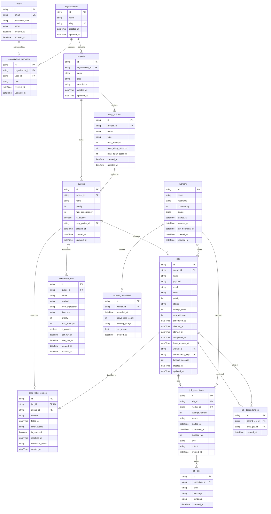
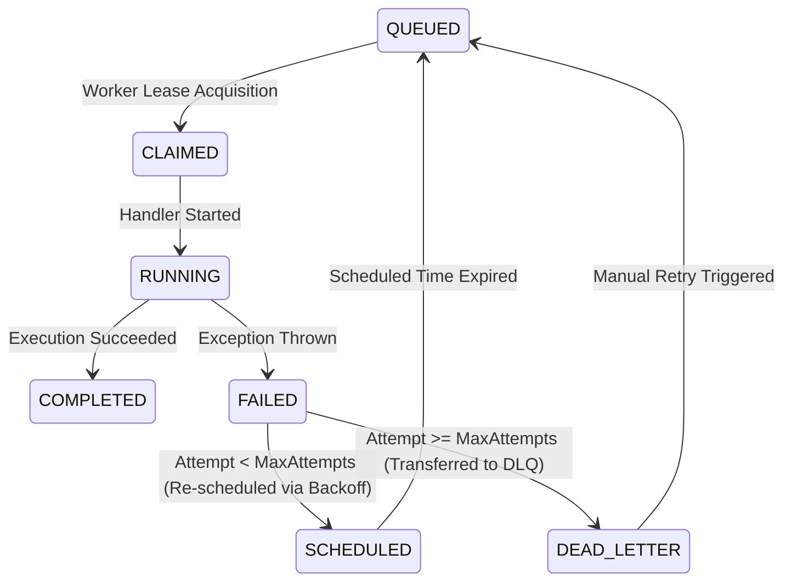

# 🗄️ SchedX - Database Design & Schema Specification

## 1. Overview & Storage Engine

SchedX utilizes **Prisma ORM** over an **SQLite** (development) / **PostgreSQL** (production) relational database engine. The database layer is designed to support:
- **High Concurrency Polling**: Fast indexing for status-based lease acquisition.
- **Idempotency Guarantees**: Unique idempotency keys to prevent duplicate enqueues.
- **Transactional Consistency**: Atomic lease claiming, execution logging, and Dead Letter Queue (DLQ) transfers.
- **Multi-Tenancy**: Organization and Project isolation with Role-Based Access Control (RBAC).

---

## 2. Entity Relationship Diagram (ERD)



---

## 3. Data Dictionary & Table Definitions

### 3.1 `users`
Stores system users for dashboard access and JWT authentication.
| Column | Type | Constraints | Description |
| :--- | :--- | :--- | :--- |
| `id` | `UUID` | Primary Key, Default: UUID | Unique user identifier |
| `email` | `String` | Unique, Required | User email address for login |
| `password_hash` | `String` | Required | Argon2/Bcrypt hashed password |
| `name` | `String` | Required | User full name |
| `created_at` | `DateTime` | Default: NOW() | Creation timestamp |
| `updated_at` | `DateTime` | Auto-update | Last modification timestamp |

### 3.2 `organizations` & `organization_members`
Multi-tenant isolation boundaries. Users belong to organizations with roles (`OWNER`, `ADMIN`, `MEMBER`).
- **Unique Constraint**: `@@unique([organization_id, user_id])`

### 3.3 `queues`
Defines priority queues with maximum concurrency limits and active engine states.
| Column | Type | Constraints | Description |
| :--- | :--- | :--- | :--- |
| `id` | `UUID` | Primary Key | Queue identifier |
| `project_id` | `UUID` | Foreign Key (`projects.id`) | Owning project ID |
| `name` | `String` | Unique per Project | Queue identifier (e.g., `emails`, `reports`) |
| `priority` | `Int` | Default: 5 | Queue priority level (0-10) |
| `max_concurrency` | `Int` | Default: 5 | Max parallel executing jobs |
| `is_paused` | `Boolean` | Default: `false` | Engine execution toggle |

### 3.4 `jobs`
The primary table managing job dispatch, lease locking, scheduling, and execution state.
| Column | Type | Index / Constraints | Description |
| :--- | :--- | :--- | :--- |
| `id` | `UUID` | Primary Key | Unique job ID |
| `queue_id` | `UUID` | Foreign Key (`queues.id`) | Target queue |
| `name` | `String` | Required | Handler action name (e.g. `send_email`) |
| `payload` | `Text` | Default: `{}` | JSON string payload |
| `status` | `String` | Indexed | `QUEUED`, `CLAIMED`, `RUNNING`, `COMPLETED`, `FAILED`, `SCHEDULED`, `DEAD_LETTER` |
| `attempt_count` | `Int` | Default: 0 | Current attempt iteration |
| `max_attempts` | `Int` | Default: 3 | Maximum allowed retries |
| `scheduled_at` | `DateTime` | Indexed | Timestamp when job becomes eligible for execution |
| `lease_expires_at` | `DateTime` | Indexed | Lease expiration lock timestamp |
| `worker_id` | `UUID` | Foreign Key (`workers.id`) | Assigned worker node |
| `idempotency_key` | `String` | Unique, Nullable | Prevents duplicate enqueuing |

---

## 4. Indexing & Query Performance Strategy

To ensure zero lock contention and instantaneous worker polling, the following composite and single-column indexes are enforced:

```prisma
// Job Polling Index (Composite)
@@index([queueId, priority, scheduledAt, createdAt])

// High-frequency Status Lookup
@@index([status])

// Lease Lock Expiration Index
@@index([leaseExpiresAt])

// Scheduled Execution Filter
@@index([scheduledAt])

// Execution Logs Lookup
@@index([executionId, createdAt])

// Worker Metrics Time-Series Lookup
@@index([workerId, recordedAt])
```

---

## 5. Job Status State Machine



---

## 6. Cascading Deletion & Referential Integrity

- **Cascade Delete**: Deleting an `Organization` cascades to all `OrganizationMember` records and `Project` entities.
- **Cascade Delete**: Deleting a `Project` cascades to all child `Queue` and `RetryPolicy` definitions.
- **Cascade Delete**: Deleting a `Queue` cascades to all associated `Job`, `ScheduledJob`, and `DeadLetterEntry` records.
- **Set Null**: Deleting a `Worker` sets `worker_id` on active or historical `Job` records to `NULL`, maintaining execution log auditability.
