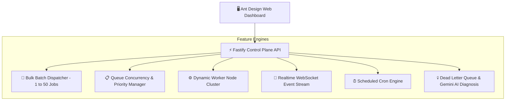

# 📚 SchedX - Master System Documentation

Welcome to the official master documentation for **SchedX**, a high-throughput, fault-tolerant distributed job scheduler platform built with Node.js, Fastify, Prisma ORM, React 18, and Ant Design.

---

## 1. Quick Start Guide

### 1.1 Prerequisites
- **Node.js**: v18.x or v20.x
- **npm**: v9.x or v10.x

### 1.2 Installation & Setup

1. **Clone & Install Dependencies**:
   ```bash
   npm install
   ```

2. **Initialize Database & Seed Demo Data**:
   ```bash
   # Push Prisma schema to SQLite database
   npm run db:push --workspace=@job-scheduler/database

   # Seed demo organizations, projects, queues, workers, and cron jobs
   npx tsx scripts/seed.ts
   ```

3. **Start All Development Services**:
   ```bash
   # Terminal 1: REST API & WebSocket Server (Port 4000)
   npm run dev:api

   # Terminal 2: Background Polling Worker Daemon
   npm run dev:worker

   # Terminal 3: Ant Design Web Dashboard (Port 3000)
   npm run dev:web
   ```

### 1.3 Access Links & Demo Credentials
- 🖥️ **Web Dashboard**: [http://localhost:3000](http://localhost:3000) (Local) / [http://172.22.11.162:3000](http://172.22.11.162:3000) (Network)
- ⚡ **REST API Server**: [http://localhost:4000](http://localhost:4000)
- 📚 **Swagger Interactive API Docs**: [http://localhost:4000/documentation](http://localhost:4000/documentation)
- 🔑 **Default Admin Email**: `admin@acme.com`
- 🔑 **Default Admin Password**: `password123`

---

## 2. Master System Specifications Index

SchedX includes dedicated technical architecture & design specification files located in the root repository folder:

| Document | Description |
| :--- | :--- |
| **[`ARCHITECTURE.md`](file:///c:/Users/gotti/Downloads/job_scheduler/ARCHITECTURE.md)** | High-level system architecture, Mermaid dataflow diagrams, monorepo directory mapping, and subsystem descriptions. |
| **[`DATABASE_DESIGN.md`](file:///c:/Users/gotti/Downloads/job_scheduler/DATABASE_DESIGN.md)** | Entity Relationship Diagram (ERD), table data dictionary, indexing rules, cascade deletion policies, and Prisma schema details. |
| **[`BACKEND_ENGINEERING.md`](file:///c:/Users/gotti/Downloads/job_scheduler/BACKEND_ENGINEERING.md)** | Fastify API gateway, route controllers, worker polling mechanics, cron scheduler, and retry backoff math. |
| **[`FRONTEND_AND_UX.md`](file:///c:/Users/gotti/Downloads/job_scheduler/FRONTEND_AND_UX.md)** | React 18 Single Page Application, Ant Design Light Theme token customization, component layouts, and user flows. |
| **[`RELIABILITY_AND_CONCURRENCY.md`](file:///c:/Users/gotti/Downloads/job_scheduler/RELIABILITY_AND_CONCURRENCY.md)** | Atomic lease locking (`leaseExpiresAt`), stale worker self-healing, unique idempotency keys, and DLQ isolation. |
| **[`API_DESIGN.md`](file:///c:/Users/gotti/Downloads/job_scheduler/API_DESIGN.md)** | Complete REST API endpoint reference, request/response JSON schemas, WebSocket event formats, and error code matrix. |

---

## 3. System Capabilities & Core Features



### Key Feature Highlights:
- **Ant Design Light Theme UI**: High-contrast, responsive dashboard with zero letter-wrapping navbar layout.
- **Bulk Batch Dispatching**: Dispatch 1 to 50 background jobs in a single click with custom payload runtimes (`1s`, `3s`, `5s`) and execution modes (`Standard Success`, `Simulate Failure`, `Scheduled Delay`).
- **Dynamic Worker Cluster**: Add, monitor, stop, or remove active worker nodes directly from the UI or REST API.
- **Queue Controls**: Pause/resume priority queues and adjust maximum concurrency limits on the fly.
- **Dead Letter Queue & AI Diagnosis**: Transfer permanently failed jobs to DLQ and trigger **Gemini AI** to diagnose root causes and output resolution steps.

---

## 4. Operational Playbook & Tasks

### 4.1 Running Production Build
To verify type check and compile production bundles for deployment:
```bash
npm run build
```
Production web assets will be generated in `apps/web/dist`.

### 4.2 Exposing Dashboard to Local Network
Vite is pre-configured with `host: '0.0.0.0'`. Any device connected to your local Wi-Fi / LAN can access the live dashboard using your IP address:
```
http://172.22.11.162:3000
```

### 4.3 Running Unit & Integration Tests
```bash
npm run test
```
