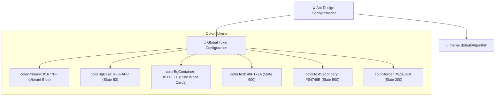
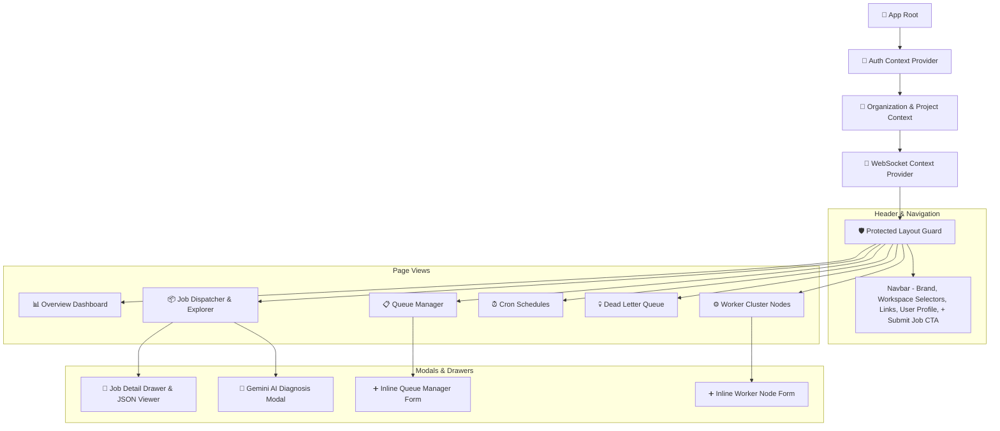
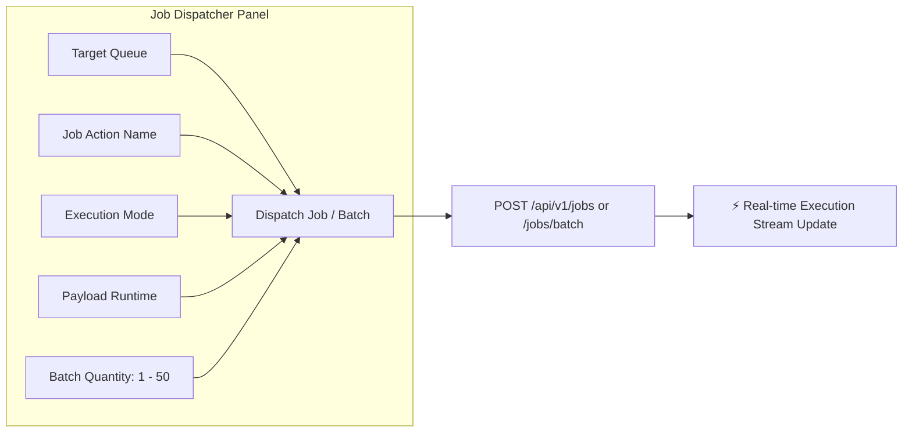

# 🎨 SchedX - Frontend Architecture & User Experience (UX) Specification

## 1. Overview & Technology Stack

The **SchedX** web application is built as a modern, high-performance Single Page Application (SPA) using **React 18**, **TypeScript**, and **Ant Design v5**. It delivers real-time visibility into distributed background job queues, execution logs, worker health metrics, and cron schedules with zero page reloads.

### Frontend Tech Stack:
- **UI Framework**: Ant Design v5 (`antd`) with CSS-in-JS token customization
- **Bundler & Build Tool**: Vite 5 (Lightning-fast HMR and optimized production chunks)
- **Data Fetching & Cache**: TanStack React Query v5 (Declarative query management & polling)
- **Routing**: React Router v6 (Nested routes & protected layout guards)
- **Icon Suite**: `@ant-design/icons` & `lucide-react`
- **Realtime State**: Native WebSockets (`ws://localhost:4000/ws`) with automatic reconnect

---

## 2. Design System & Theme Configuration

SchedX adopts a crisp, modern **Light Theme** engineered for readability, high-contrast metrics, and effortless navigation.



---

## 3. Component Architecture & Page Layout



---

## 4. Key Page Views & UX Highlights

### 4.1 Header Navigation Bar (`Navbar.tsx`)
- **Brand Identity**: SchedX logo with square avatar badge and version indicator.
- **Workspace Selectors**: Dropdowns for instant switching between Organizations (e.g. `Acme Corp`) and Projects (e.g. `Analytics Engine`).
- **Navigation Links**: Highlighting active routes with soft blue backgrounds (`rgba(22, 119, 255, 0.08)`).
- **Status Indicator**: Realtime connection badge (`Realtime Live` green tag or `Polling` default tag).
- **Primary CTA**: **`+ Submit Job`** button anchored cleanly inside the top-right header area.

---

### 4.2 Overview Dashboard (`Overview.tsx`)
1. **Hero Section**: Key architecture capabilities and dual primary CTAs (`Submit Job Now`, `Browse Active Queues`).
2. **KPI Metric Cards**: Real-time stats powered by Ant Design `<Statistic>`:
   - **Active Queues**: Total queue count and paused count.
   - **Active Workers**: Live active polling worker node count.
   - **Recent Executions**: Latest completed job executions.
   - **System Health**: Health status pill indicator (`Optimal`).
3. **Active Queues & Executions Breakdown**: Tables showcasing queue priorities (`p5`), concurrency limits, retry policies, and execution status tags.

---

### 4.3 Job Dispatcher & Explorer (`Jobs.tsx`)



- **Bulk Batch Dispatching**: Dispatch 1 to 50 background jobs in a single click with configurable runtimes (`Short 1s`, `Medium 3s`, `Long 5s`) and modes (`Standard Success`, `Simulate Failure`, `Scheduled Delay`).
- **Status Filter Pills**: Quick filter tabs for `ALL`, `QUEUED`, `RUNNING`, `COMPLETED`, `FAILED`, and `DEAD LETTER`.
- **Side Drawer & JSON Viewer**: Clicking any job opens a right drawer showing complete payload parameters, execution outputs, and exception traces formatted with syntax-highlighted JSON.

---

### 4.4 Queue Manager (`Queues.tsx`)
- **Inline Creation Form**: `QUEUE IDENTIFIER`, `PRIORITY (0-10)`, `CONCURRENCY LIMIT`, and `RETRY POLICY` (`Exponential Backoff`, `Linear Backoff`, `Fixed Delay`).
- **Queue Table**: Pause/Resume toggle buttons and Popconfirm deletion dialogs.

---

### 4.5 Worker Nodes Cluster (`Workers.tsx`)
- **Inline Registration**: Quickly add new worker nodes with custom names, hostname definitions, and concurrency slot counts.
- **Worker Cards Grid**: Visual node cards displaying online/stopped status tags, host details, last executed job name (`Going to Toxic-7 (completed)` or `Idle (-)`), and heartbeat timestamps.

---

### 4.6 Dead Letter Queue & AI Diagnosis (`DeadLetterQueue.tsx`)
- **Failure Auditing**: Full transparency into permanently failed jobs.
- **AI Diagnosis Button**: Triggers a modal connecting to **Gemini AI** to diagnose root causes and output step-by-step resolution notes.
- **Manual Retry & Resolution**: Re-enqueue failed jobs back into active queues or mark them as resolved.

---

## 5. Realtime State Sync & Caching Strategy

SchedX uses a hybrid approach combining **WebSocket events** and **React Query automatic cache invalidation**:

```typescript
// WebSocket listener invalidates React Query caches on real-time events
useWebSocketListener((event) => {
  if (event.type === 'JOB_UPDATED' || event.type === 'JOB_DISPATCHED') {
    queryClient.invalidateQueries({ queryKey: ['jobs'] });
    queryClient.invalidateQueries({ queryKey: ['executionStream'] });
  }
});
```

---

## 6. Responsive Layout Breakpoints

| Device Breakpoint | Screen Width | Layout Adaptation |
| :--- | :--- | :--- |
| **Mobile** | `< 640px` | Single column stacked forms, scrollable horizontal header |
| **Tablet** | `640px - 1024px` | 2-column metric cards, responsive drawer width (380px) |
| **Desktop** | `1024px - 1440px` | 4-column metric grid, full Ant Design table views |
| **Ultrawide** | `> 1440px` | Centered 1280px max-width container with edge padding |
