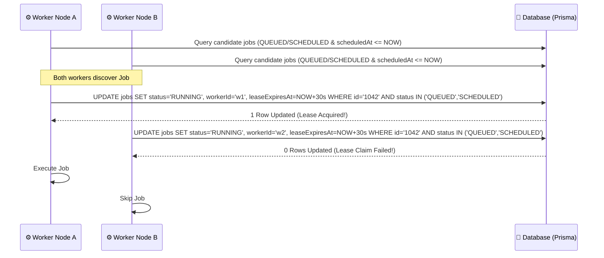
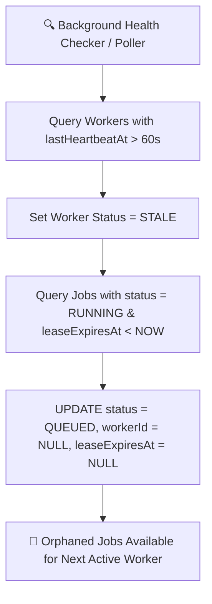
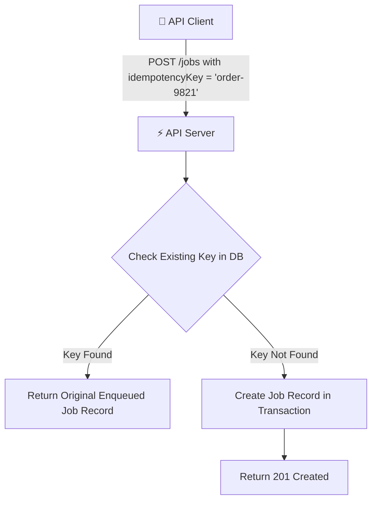
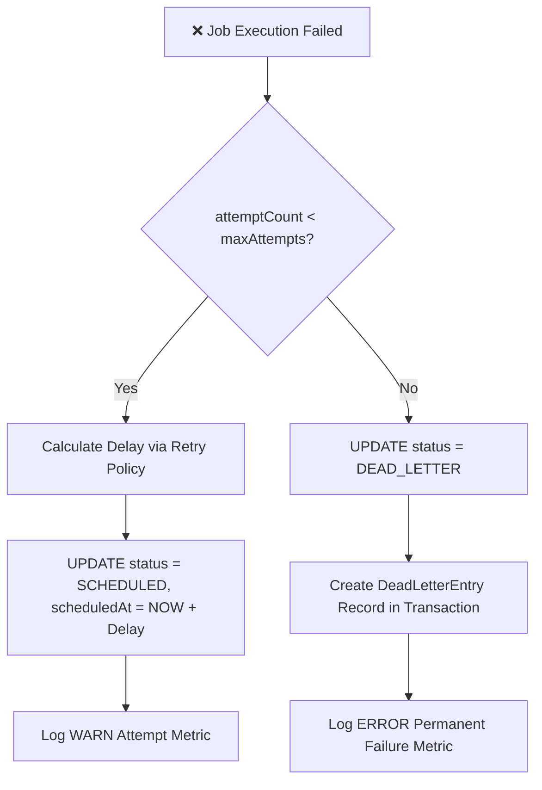

# 🛡️ SchedX - Reliability & Concurrency Engineering Specification

## 1. Core Reliability Guarantees

SchedX is built to process high-volume background jobs under harsh operating conditions (worker crashes, network partitions, database latency). The system provides three foundational guarantees:

1. **At-Least-Once Execution**: Every enqueued job will be processed by a worker node at least once until it succeeds or exhausts its configured maximum retries.
2. **Zero Double-Execution (Atomicity)**: Optimistic lease locking ensures that no two worker nodes ever claim or execute the same job concurrently.
3. **Strict Concurrency Scoping**: Queue-level `maxConcurrency` limits and worker-level slot capacity are enforced to prevent downstream service flooding.

---

## 2. Atomic Lease Acquisition & Optimistic Concurrency

### Lease Lock Parameters:
- **Default Lease Duration**: 30 seconds (`leaseExpiresAt = NOW() + 30000ms`).
- **Heartbeat Lock Renewal**: For long-running payloads (e.g. 5+ minute jobs), active workers periodically extend `leaseExpiresAt` before expiration.

---

## 3. Self-Healing & Stale Lease Recovery

If a worker node experiences a sudden power loss, process crash, or network isolation while holding a lease lock, SchedX self-heals without human intervention.

### Self-Healing Metrics:
- **Worker Heartbeat Interval**: 10,000 ms.
- **Worker Stale Threshold**: 60,000 ms without heartbeat.
- **Lease Expiration Threshold**: 30,000 ms.

---

## 4. Idempotency Engine

To prevent duplicate job creation caused by client retries or duplicate webhook delivery, SchedX supports optional `idempotencyKey` values.

- **Database Constraint**: `@@unique([idempotency_key])` at the database level guarantees strict uniqueness even under extreme API request parallelism.

---

## 5. Transactional Retry Policy & Backoff Mechanics

When a job handler throws an unhandled operational exception, SchedX executes a transactional retry evaluation:

### Exponential Backoff Math:
$$\text{delaySeconds} = \min(\text{baseDelaySeconds} \times 2^{(\text{attemptCount} - 1)}, \text{maxDelaySeconds})$$

---

## 6. Dead Letter Queue (DLQ) & Failure Isolation

Jobs that exhaust all retry attempts are safely isolated into the **Dead Letter Queue (DLQ)** to prevent repeated failure loops from clogging active queues.

### Features of DLQ:
1. **Failure Auditability**: Captures complete error stack trace, attempt history, and payload data.
2. **AI Diagnosis Integration**: Connects to **Gemini AI** to analyze error trace root causes and suggest fix steps.
3. **Manual Re-enqueuing**: Operators can fix underlying issues (e.g. database connection or third-party service) and trigger **Manual Retry** directly from the UI or API.

---

## 7. Queue Concurrency & Rate Limiting

Each queue defines a `maxConcurrency` parameter (1 to 50 slots).

- **Slot Counting**: The worker poller calculates active executions (`COUNT(status = RUNNING AND queueId = targetQueue)`) before claiming new jobs.
- **Queue Pause/Resume**: When `isPaused = true`, workers immediately skip job claiming for that queue, preserving enqueued jobs in `QUEUED` state safely.
