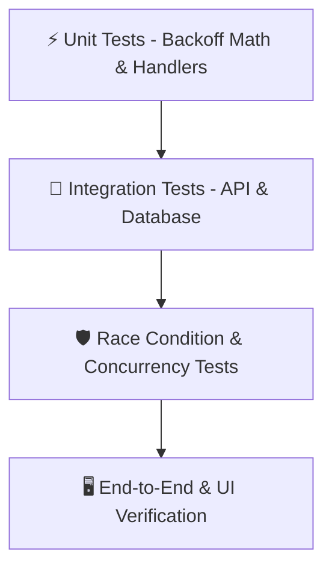
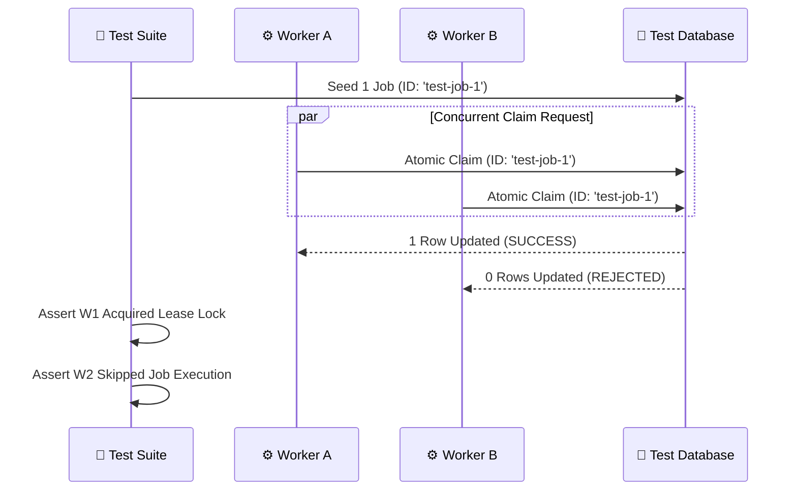

# 🧪 SchedX - Testing & Verification Specification

## 1. Overview & Test Strategy

SchedX employs a multi-tiered testing strategy ensuring reliability, zero double-execution guarantees, RBAC security, and real-time frontend responsiveness across the monorepo workspaces.



### Test Stack:
- **Test Runner**: Vitest / Jest (Fast parallel test execution)
- **Database Isolation**: Dedicated SQLite test database (`test.db`) initialized before test runs
- **HTTP Assertion**: Supertest / Fastify `inject()` for in-memory HTTP API testing
- **Frontend Testing**: React Testing Library & Vitest for component & hook testing

---

## 2. Test Suites Breakdown

### 2.1 Database & ORM Tests (`packages/database`)
- **Idempotency Key Constraints**: Verifies that inserting two jobs with the same `idempotencyKey` throws a unique constraint violation error (`P2002`).
- **Cascading Deletions**: Verifies deleting an `Organization` or `Project` automatically cleans up associated `Queue`, `Job`, and `JobExecution` records.

### 2.2 API & Control Plane Tests (`apps/api`)
- **Authentication Routes**: Validates `/api/v1/auth/register`, `/login`, and JWT token generation.
- **RBAC Authorization Middleware**: Ensures `MEMBER` users cannot perform administrative actions like queue deletion or worker registration.
- **Batch Dispatcher Validation**: Verifies `POST /api/v1/jobs/batch` accepts array payloads (1 to 50 jobs) and fails cleanly on malformed payloads.

### 2.3 Worker Engine & Lease Concurrency Tests (`apps/worker`)
- **Atomic Lease Lock Race Test**: Simulates 10 concurrent worker threads attempting to claim the same candidate job (`status = QUEUED`). Asserts that **exactly 1 worker** acquires the lease (`1 row updated`) and **9 workers** fail the claim (`0 rows updated`).
- **Exponential Backoff Calculations**: Validates retry delay calculations:
  - Attempt 1: $5 \times 2^0 = 5\text{s}$
  - Attempt 2: $5 \times 2^1 = 10\text{s}$
  - Attempt 3: $5 \times 2^2 = 20\text{s}$
- **DLQ Transfer Engine**: Verifies that when `attemptCount >= maxAttempts`, the job status transitions to `DEAD_LETTER` and a `DeadLetterEntry` record is created in a single database transaction.

### 2.4 Frontend UI & Integration Tests (`apps/web`)
- **Ant Design Form Integration**: Verifies input validations in `JobDispatcher`, `QueueManager`, and `WorkerManager`.
- **Status Filter Pills**: Asserts clicking filter tags (`ALL`, `QUEUED`, `RUNNING`, `COMPLETED`, `FAILED`, `DEAD LETTER`) correctly filters table data source rows.

---

## 3. Test Execution Commands

```bash
# Run unit & integration test suites across all workspaces
npm run test

# Run API control plane tests
npm run test --workspace=@job-scheduler/api

# Run worker execution engine tests
npm run test --workspace=@job-scheduler/worker

# Run frontend web component tests
npm run test --workspace=@job-scheduler/web
```

---

## 4. Concurrency & Failure Simulation



---

## 5. Continuous Integration (CI) Workflow Example

Below is the GitHub Actions CI pipeline configuration (`.github/workflows/ci.yml`):

```yaml
name: SchedX CI Pipeline

on:
  push:
    branches: [ main ]
  pull_request:
    branches: [ main ]

jobs:
  build-and-test:
    runs-on: ubuntu-latest

    steps:
      - name: Checkout Repository
        uses: actions/checkout@v3

      - name: Setup Node.js
        uses: actions/setup-node@v3
        with:
          node-version: 20
          cache: 'npm'

      - name: Install Dependencies
        run: npm ci

      - name: Database Schema Push
        run: npm run db:push --workspace=@job-scheduler/database

      - name: Typecheck Monorepo
        run: npm run build

      - name: Run Test Suite
        run: npm run test
```
