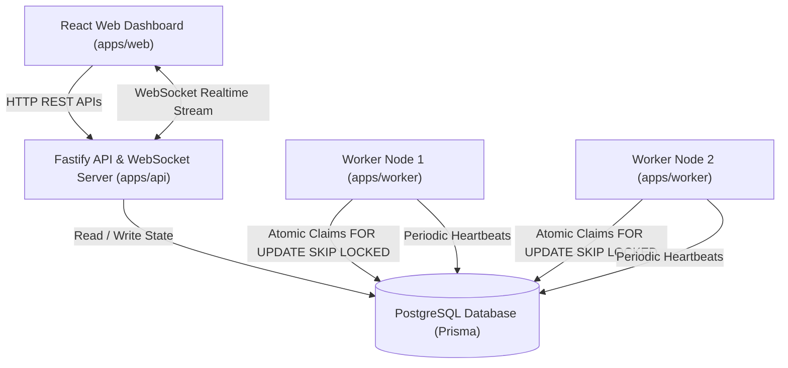

# System Architecture - Distributed Job Scheduling Platform

## 1. High-Level Architecture Overview

This platform is engineered as a production-grade distributed job scheduling and execution system. It separates the REST & WebSocket control plane (`apps/api`) from the background worker execution plane (`apps/worker`), backed by a shared PostgreSQL database (`packages/database`) as the transactional source of truth.

---

## 2. Component Responsibilities

### A. API Server (`apps/api`)
- **Authentication & RBAC**: Issues JWT tokens, hashes passwords using `bcrypt`, enforces organization membership and role permissions (`OWNER`, `ADMIN`, `MEMBER`).
- **Control Plane**: Provides REST endpoints for Organizations, Projects, Queues, Jobs, Cron Schedules, DLQ, and Worker Node monitoring.
- **Validation & Rate Limiting**: Enforces strict payload validation with `Zod` schemas and rate limits requests.
- **WebSocket Gateway**: Publishes real-time state change events (`JOB_UPDATED`, `QUEUE_STATS_UPDATED`, `WORKER_HEARTBEAT`, `DLQ_ENTRY_ADDED`) to connected web dashboards.
- **Background Cron Scheduler**: Evaluates recurring `ScheduledJob` cron expressions and moves due items to `QUEUED` status.

### B. Worker Engine (`apps/worker`)
- **Independent Scalability**: Can run as multiple concurrent OS processes across cluster nodes.
- **Atomic Job Claims**: Uses PostgreSQL transactions with `SELECT ... FOR UPDATE SKIP LOCKED` to ensure no two workers can claim the same job.
- **Queue Concurrency Enforcement**: Checks queue `maxConcurrency` limits before claiming jobs.
- **Execution & Logging**: Invokes registered job handlers (`send_email`, `generate_report`, `webhook`, etc.), records `JobExecution` attempt records, and writes detailed `JobLog` entries.
- **Retry & Lease Recovery**: Calculates retry backoff schedules (Fixed, Linear, Exponential), transfers exhausted jobs to DLQ, and recovers expired worker leases.
- **Graceful Shutdown**: Intercepts `SIGINT` / `SIGTERM`, stops polling, finishes in-progress tasks up to a timeout, releases uncompleted claims, and marks worker status as `STOPPED`.

### C. Web Dashboard (`apps/web`)
- Built with React, TypeScript, Vite, Tailwind CSS, and TanStack React Query.
- Responsive dashboard supporting queue management, live job explorer with side-drawer, worker cluster status, DLQ management, and AI failure diagnostics.

### D. Shared Library (`packages/shared`) & Database (`packages/database`)
- Centralized TypeScript interfaces, retry backoff algorithms, Zod validation schemas, and Prisma ORM schemas.

---

## 3. Worker Concurrency & Safety Model

1. **Worker Concurrency Limit**: Each worker process manages up to `WORKER_CONCURRENCY` parallel execution promises.
2. **Queue Max Concurrency**: The claim engine counts current `CLAIMED` / `RUNNING` jobs per queue. If `currentRunning >= maxConcurrency`, the queue is bypassed during job claiming.
3. **Queue Pause Control**: If `isPaused = true`, jobs in the queue are ignored by workers and new submissions are rejected by the API server.
