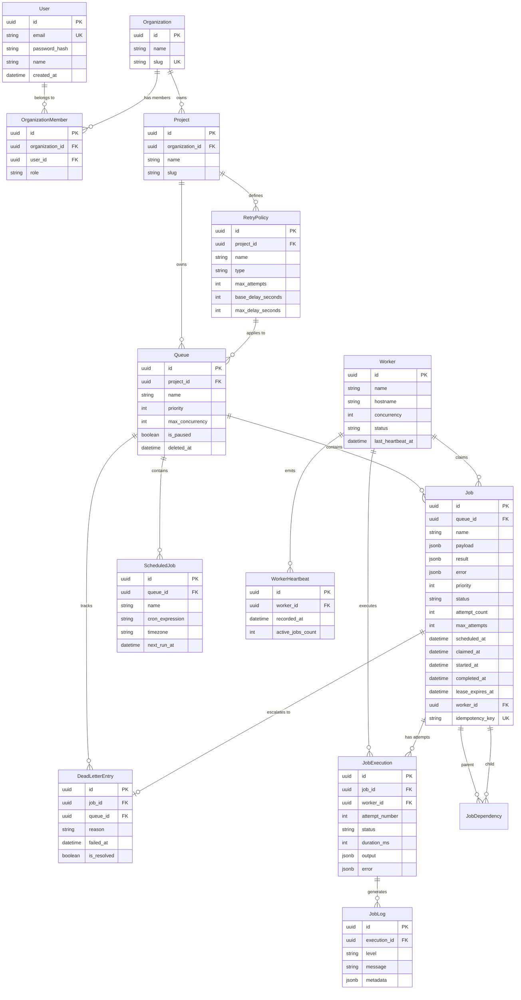

# Database ER Diagram & Schema Specification

## 1. Entity Relationship Diagram

---

## 2. Table Cardinalities & Constraints

| Entity | Primary Key | Key Foreign Keys | Unique Constraints | Cascade Rules | Soft Delete |
|:---|:---|:---|:---|:---|:---|
| `users` | `id` (UUID) | - | `email` | - | No |
| `organizations` | `id` (UUID) | - | `slug` | Cascade to projects/members | No |
| `organization_members` | `id` (UUID) | `organization_id`, `user_id` | `[organization_id, user_id]` | Cascade delete | No |
| `projects` | `id` (UUID) | `organization_id` | `[organization_id, slug]` | Cascade to queues/retry policies | No |
| `queues` | `id` (UUID) | `project_id`, `retry_policy_id` | `[project_id, name]` | Set Null on retry policy delete | Yes (`deleted_at`) |
| `retry_policies` | `id` (UUID) | `project_id` | - | Cascade delete | No |
| `jobs` | `id` (UUID) | `queue_id`, `worker_id` | `idempotency_key` | Cascade to executions/logs/DLQ | No |
| `job_executions` | `id` (UUID) | `job_id`, `worker_id` | - | Cascade to logs | No |
| `job_logs` | `id` (UUID) | `execution_id` | - | Cascade delete | No |
| `scheduled_jobs` | `id` (UUID) | `queue_id` | - | Cascade delete | No |
| `workers` | `id` (UUID) | - | - | Set Null on job claim release | No |
| `worker_heartbeats` | `id` (UUID) | `worker_id` | - | Cascade delete | No |
| `dead_letter_entries` | `id` (UUID) | `job_id`, `queue_id` | `job_id` | Cascade delete | No |

---

## 3. High-Performance Index Design

The schema defines indexes optimized specifically for worker queries, queue stats, and execution logs:

1. **Job Claim Index**:
   `jobs(queue_id, priority DESC, scheduled_at ASC, created_at ASC) WHERE status = 'QUEUED'`
   *Optimizes `SELECT FOR UPDATE SKIP LOCKED` worker polling queries.*

2. **Scheduled Job Index**:
   `jobs(scheduled_at ASC) WHERE status = 'SCHEDULED'`
   *Accelerates scheduler scans for due delayed jobs.*

3. **Lease Recovery Index**:
   `jobs(lease_expires_at ASC) WHERE status IN ('CLAIMED', 'RUNNING')`
   *Allows instant lookup of crashed worker jobs whose lease has expired.*

4. **Job Execution History Index**:
   `job_executions(job_id, attempt_number DESC)`
   *Accelerates retrieving historical attempts for a job.*

5. **Job Log Index**:
   `job_logs(execution_id, created_at ASC)`
   *Ensures sequential streaming of log lines per execution attempt.*

6. **Worker Heartbeat Index**:
   `worker_heartbeats(worker_id, recorded_at DESC)`
   *Fast lookup for latest worker heartbeat metrics.*
